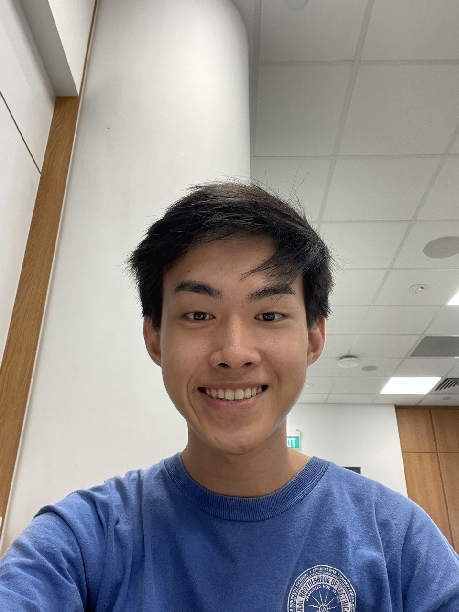
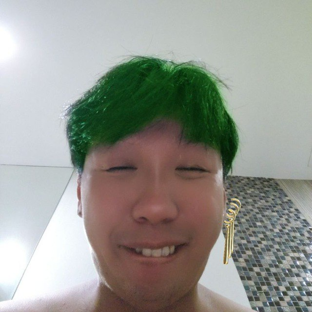
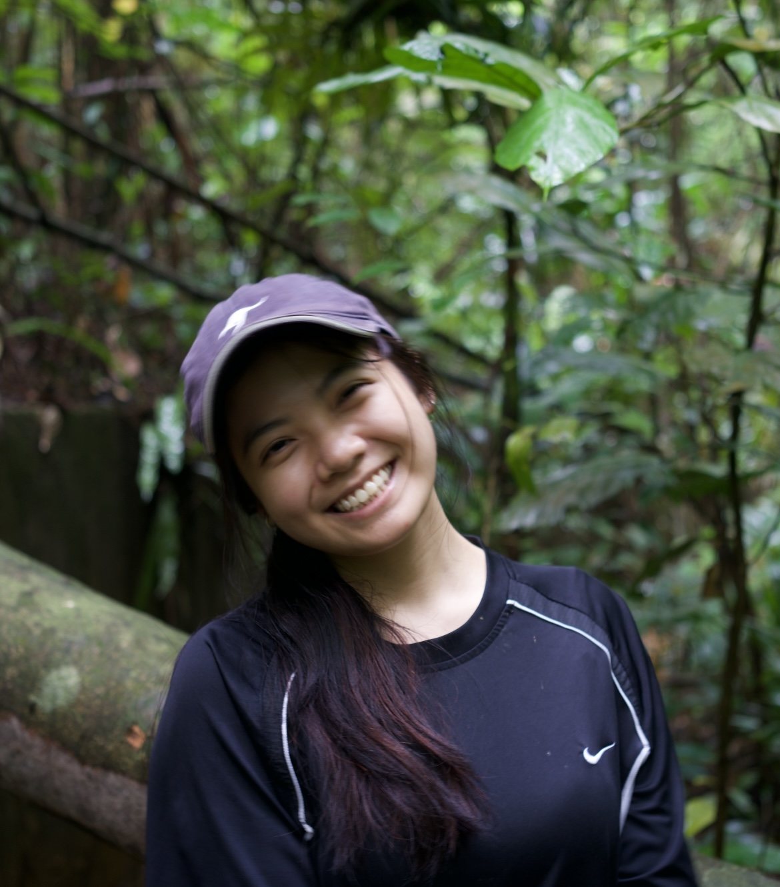
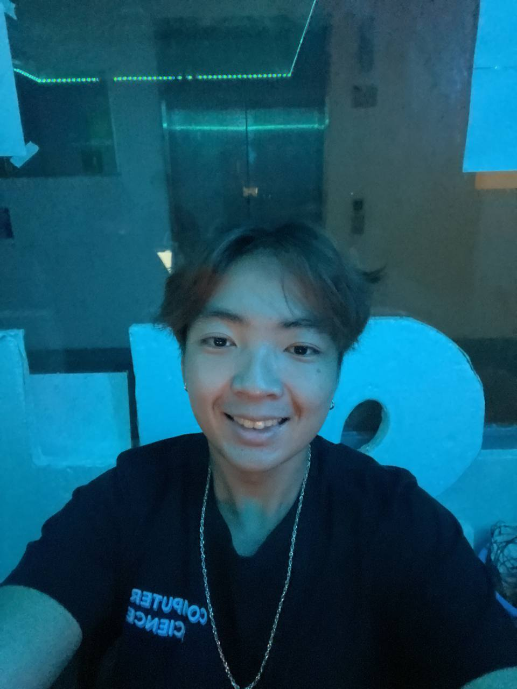
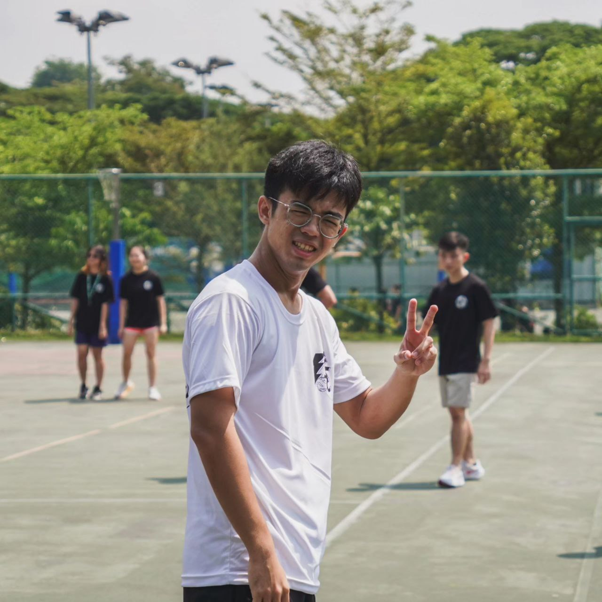

We are a team based in the [School of Computing, National University of Singapore](http://www.comp.nus.edu.sg).

You can reach us at the email `seer[at]comp.nus.edu.sg`

## Project team

### Andre Foo En Jie

[[github](https://github.com/andrefoo)]
[[portfolio](team/andrefoo.md)]

* Role: Developer

### Khiew Yiquan, Edric

[[github](http://github.com/lululwtv)]
[[portfolio](team/lululwtv.md)]

* Role: Developer
* Responsibilities: Ui

### Krista Yeo Su-Anne

[[github](http://github.com/kristayeo)]
[[portfolio](team/kristayeo.md)]

* Role: UI
* Responsibilities: Data

### Owen Yeo Le Yang

[[github](http://github.com/owenyeo)]
[[portfolio](team/owenyeo.md)]

* Role: Developer
* Responsibilities: Dev Ops + Threading

### Teo Zheng Yang

[[github](http://github.com/teozhengyang)]
[[portfolio](team/teozhengyang.md)]

* Role: Developer
* Responsibilities: UI
