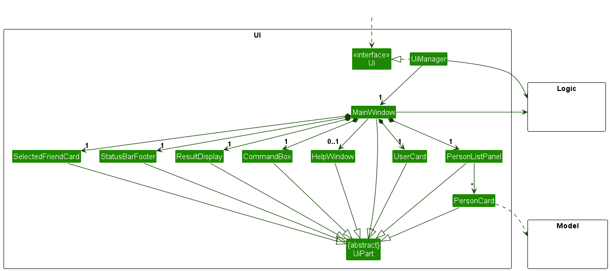
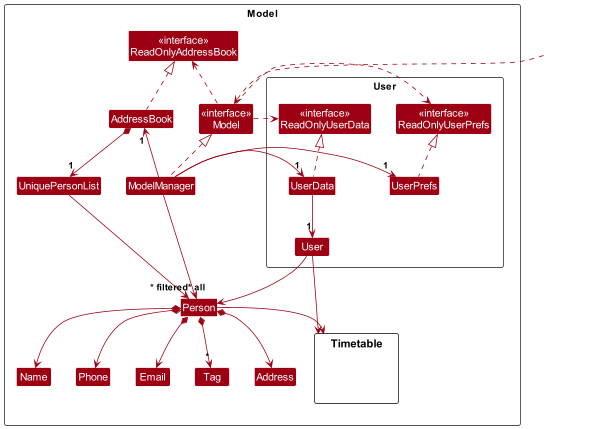
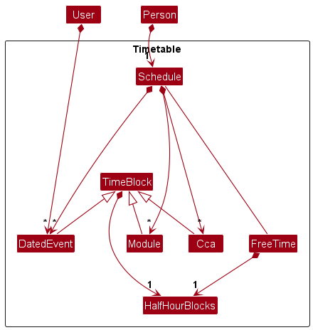
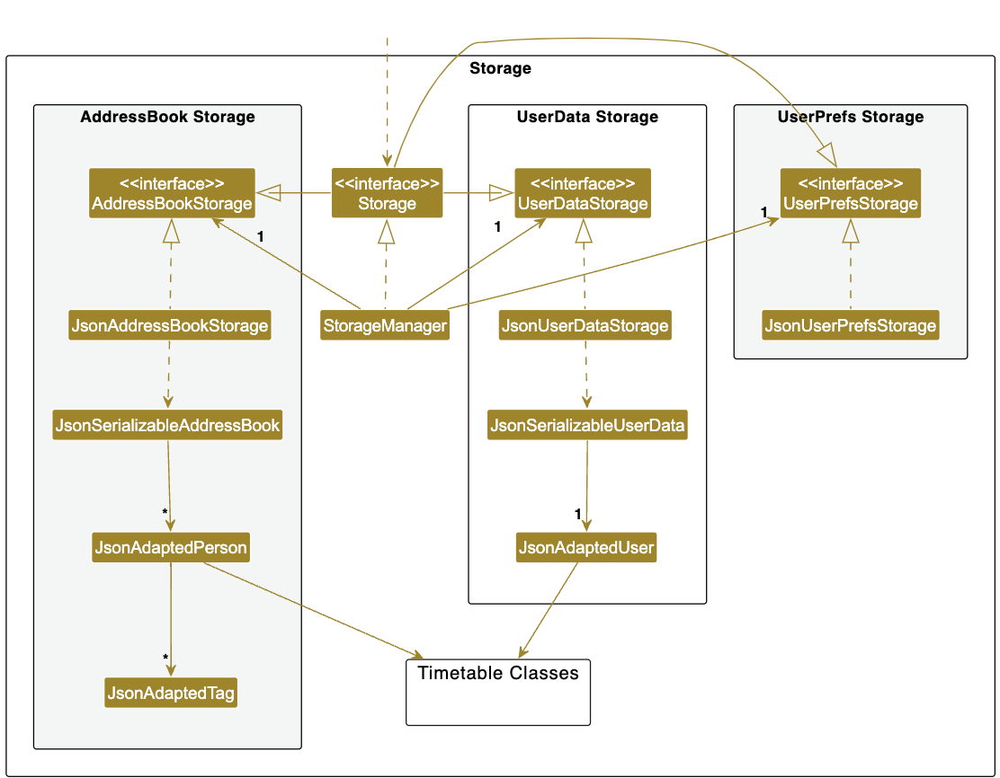
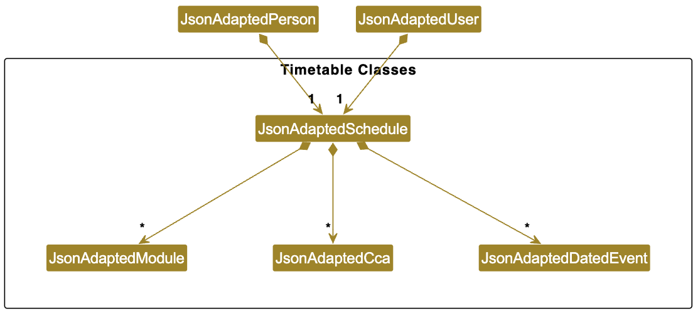
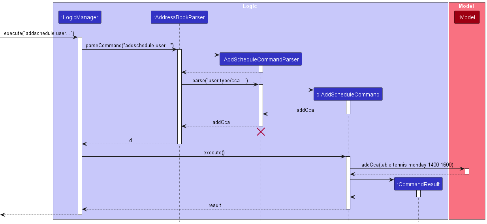
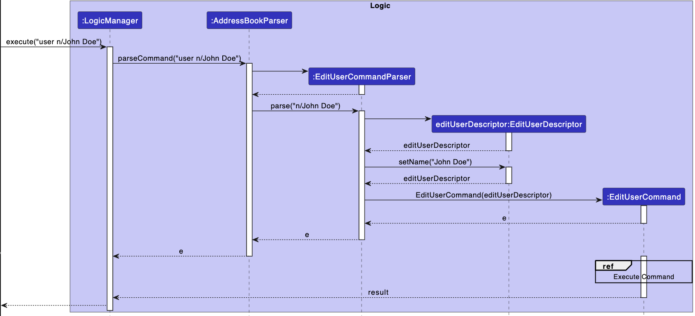
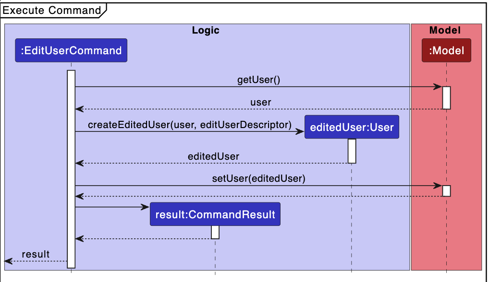
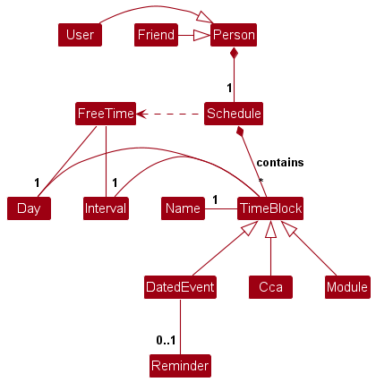
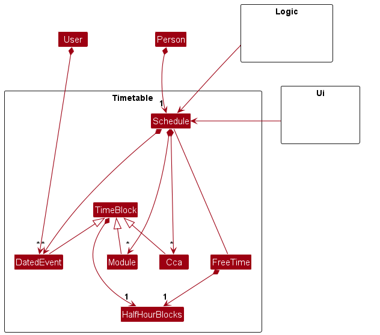

* Table of Contents
{:toc}

--------------------------------------------------------------------------------------------------------------------

## **1. Acknowledgements**

* This project is based on the AddressBook-Level3 project created by the [SE-EDU initiative](https://se-education.org).

--------------------------------------------------------------------------------------------------------------------

## **2. Setting up, getting started**

Refer to the guide [_Setting up and getting started_](SettingUp.md).

--------------------------------------------------------------------------------------------------------------------

## **3. Design**

:bulb: **Tip:** The `.puml` files used to create diagrams in this document `docs/diagrams` folder. Refer to the [_PlantUML Tutorial_ at se-edu/guides](https://se-education.org/guides/tutorials/plantUml.html) to learn how to create and edit diagrams.

### 3.1 Architecture

The ***Architecture Diagram*** given above explains the high-level design of the App.

Given below is a quick overview of main components and how they interact with each other.

**Main components of the architecture**

**`Main`** (consisting of classes [`Main`](https://github.com/se-edu/addressbook-level3/tree/master/src/main/java/seedu/address/Main.java) and [`MainApp`](https://github.com/AY2324S1-CS2103T-W12-4/tp/blob/master/src/main/java/seedu/address/MainApp.java)) is in charge of the app launch and shut down.
* At app launch, it initializes the other components in the correct sequence, and connects them up with each other.
* At shut down, it shuts down the other components and invokes cleanup methods where necessary.

The bulk of the app's work is done by the following four components:

* [**`UI`**](#ui-component): The UI of TimetaBRO.
* [**`Logic`**](#logic-component): The command executor.
* [**`Model`**](#model-component): Holds the data of TimetaBRO in memory.
* [**`Storage`**](#storage-component): Reads data from, and writes data to, the hard disk.

[**`Commons`**](#common-classes) represents a collection of classes used by multiple other components.

**How the architecture components interact with each other**

The *Sequence Diagram* below shows how the components interact with each other for the scenario where the user issues the command `delete 1`.

Each of the four main components (also shown in the diagram above),

* defines its *API* in an `interface` with the same name as the Component.
* implements its functionality using a concrete `{Component Name}Manager` class  
  (which follows the corresponding API `interface` mentioned in the previous point.)

For example, the `Logic` component defines its API in the `Logic.java` interface
and implements its functionality using the `LogicManager.java` class
which follows the `Logic` interface.
Other components interact with a given component through its interface rather than the concrete class
(Reason: to prevent outside component's being coupled to the implementation of a component),
as illustrated in the (partial) class diagram below.

The sections below give more details of each component.

### 3.2 UI component

The **API** of this component is specified in [`Ui.java`](https://github.com/AY2324S1-CS2103T-W12-4/tp/blob/master/src/main/java/seedu/address/ui/Ui.java)

**Description:**

The `UI` component manages the user interface of TimetaBRO, so it responds to any command to user inputs or action accordingly.
It uses the JavaFx Ui framework.
The layout of these UI parts are defined in matching `.fxml` files that are in the `src/main/resources/view` folder. For example, the layout of the [`MainWindow`](https://github.com/se-edu/addressbook-level3/tree/master/src/main/java/seedu/address/ui/MainWindow.java) is specified in [`MainWindow.fxml`](https://github.com/se-edu/addressbook-level3/tree/master/src/main/resources/view/MainWindow.fxml)

**Functionality:**

The `UI` component,

* displays a `Reminder` popup window at launch.
* executes user commands using the `Logic` component.
* listens for changes to `Model` data so that the UI can be updated with the modified data.
* keeps a reference to the `Logic` component, because the `UI` relies on the `Logic` to execute commands.
* depends on some classes in the `Model` component, as it displays `Person` objects residing in the `Model`.

**Component Structure:**

The UI consists of a `MainWindow` that is made up of parts e.g.`CommandBox`, `ResultDisplay`, `PersonListPanel`, `StatusBarFooter` etc. All these, including the `MainWindow`, inherit from the abstract `UiPart` class which captures the commonalities between classes that represent parts of the visible GUI.

Depending on the state of the application, certain parts of the UI are shown or hidden in `MainWindow`. eg. `HelpWindow` and `SelectedFriendCard`.

Upon TimetaBRO being launched, the `Reminder` window will be shown on the bottom right hand corner of the desktop's screen.

### 3.3 Logic component

**API** : [`Logic.java`](https://github.com/AY2324S1-CS2103T-W12-4/tp/blob/master/src/main/java/seedu/address/logic/Logic.java)

Here's a (partial) class diagram of the `Logic` component:

The sequence diagram below illustrates the interactions within the `Logic` component, taking `execute("addschedule user type/cca en/table tennis h/monday 1400 1600")` API call as an example.

:information_source: **Note:** The lifeline for `AddScheduleCommandParser` should end at the destroy marker (X) but due to a limitation of PlantUML, the lifeline reaches the end of diagram.

How the `Logic` component works:

1. When `Logic` is called upon to execute a command, it is passed to an `AddressBookParser` object which in turn creates a parser that matches the command (e.g., `AddScheduleCommandParser`) and uses it to parse the command.
2. This results in a `Command` object (more precisely, an object of one of its subclasses e.g., `AddScheduleCommand`) which is executed by the `LogicManager`.
3. The command can communicate with the `Model` when it is executed (e.g. to delete a person).
4. The result of the command execution is encapsulated as a `CommandResult` object which is returned back from `Logic`.

Here are the other classes in `Logic` (omitted from the class diagram above) that are used for parsing a user command:

How the parsing works:
* When called upon to parse a user command, the `AddressBookParser` class creates an `XYZCommandParser` (`XYZ` is a placeholder for the specific command name e.g., `AddCommandParser`) which uses the other classes shown above to parse the user command and create a `XYZCommand` object (e.g., `AddCommand`) which the `AddressBookParser` returns back as a `Command` object.
* All `XYZCommandParser` classes (e.g., `AddCommandParser`, `DeleteCommandParser`, ...) inherit from the `Parser` interface so that they can be treated similarly where possible e.g, during testing.

### 3.4 Model component
**API** : [`Model.java`](https://github.com/AY2324S1-CS2103T-W12-4/tp/blob/master/src/main/java/seedu/address/model/Model.java)

**Description:**

The `Model` component stores and manages data. It accomplishes this by creating and maintaining a runtime representation of the data utilising Java's Object Oriented Programming abilites. These objects are abstract representations of their real world counterparts and their relationships with each other, simulating their relationships.

**Functionality:**

* `Model` is not dependent on the other packages.
* `Ui` references the `Model` to retrieve relevant information about the `User` and the friends to be displayed on the `MainWindow`.
* `Logic` component communicates with the `Model` to make modifications based on the commands inputted.
* `Storage` component refers to the `Model` to store the data on the computer's local memory.

**Component structure:**

The `Model` can be broken down into its subpackages:

* `Person` subpackage:
  * Represents a `Person` in TimetaBRO and their attributes that the application manages,
    namely their `Name`, `Phone` number, `Email`, `Address`, `Birthday` and `Schedule`.
  * `UniquePersonList` ensures that the list of persons does not contain duplicate phone numbers or emails, and supports basic list operations.\
    
  * `timetable` subpackage encapsulates a person's schedule that includes a list of module timings (`Module`),
    co-curricular activities timings (`Cca`), and dated events (`DatedEvent`). The `Schedule` class provides functionality
    to retrieve the schedule for the current week, for a specific day, and to manage free time within the schedule. It also
    supports operations to add, edit, and delete various time blocks like modules and CCAs, ensuring that there are no
    overlapping events.
* `user` subpackage:
  * The `User` class extends the `Person` class and includes additional management for dated events specific to the user. It allows for setting and removing reminders for events, retrieving events with reminders for the current day, and managing the user's dated events.
* `util` subpackage:
  * The `SampleUtilData` utility class populates the `AddressBook` with sample data, providing first-time users a perspective of the application in use.

### 3.5 Storage component

**API** : [`Storage.java`](https://github.com/se-edu/addressbook-level3/tree/master/src/main/java/seedu/address/storage/Storage.java)

The `Storage` component,
* can save address book data, user preference, and user data in JSON format, and read them back into corresponding objects.
* inherits from `AddressBookStorage`, `UserPrefStorage`, and `UserDataStorage` which means it can be treated as any one (if only the functionality of only one is needed).
* depends on some classes in the `Model` component (because the `Storage` component's job is to save/retrieve objects that belong to the `Model`)

The `Timetable` Classes
* Allows users to save their friends' and their own timetables in JSON format, and read them back into corresponding objects
* Depends on the related files in `Model`.

### 3.6 Common classes

Classes used by multiple components are in the `seedu.addressbook.commons` package.

--------------------------------------------------------------------------------------------------------------------

## **4. Implementation**

This section describes some noteworthy details on how certain features are implemented.

### 4.1 Reminder feature

#### 4.1.1 Description

The app will display a popup window with reminders for events with reminder set for them and
for birthdays on the day itself at launch.

#### 4.1.2 Implementation
- At launch, the `showReminder` method in `Reminder` is called.
- `showReminder` calls `returnRemindedEvent` in `User` object to get a list of events with reminders set for them and
`getBirthdayList` in `Model` object to get a list of birthdays on the day itself.
- `returnRemindedEvent` will check for dated events with reminders set for them in the `User` object's schedule
and return a list of them.
- `getBirthdayList` will call the `getBirthdayList` method in `AddressBook` object.
- `getBirthdayList` of the `AddressBook` object will return a list of `Person` objects in the `User` object's contacts
who has birthdays on the day itself.
- `showReminder` will then display birthday reminders followed by dated events reminders in the relevant textareas.

### 4.2 Add friend's schedule feature

#### 4.2.1 Description
User can add a recurring event to their friend's timetable, such as a Module or a CCA, to indicate their friend's weekly schedules. This can be done so using the command word `addschedule`, followed by an INDEX (either "user" or an index number reflecting the index of the friend in the friends list), and the following prefixes: 
- `type/`: Schedule type - Module/CCA
- `en/`: CCA/Module name
- `h/` : Day, Start Time and End Time (DDD HHMM HHMM)

#### 4.2.2 Implementation
- The `MainWindow#executeCommand()` calls `LogicManager#execute()` method, which proceeds to call `AddressBookParser#parseCommand()` method, which then calls `AddScheduleCommandParser#parse()`.
- `AddScheduleCommandParser#parse()` parses the information from all the different prefixes, and returns a new instance of `AddScheduleCommand` with the relevant parsed information
- The `AddScheduleCommand` is then passed up to the `LogicManager`
- `LogicManager#execute(AddScheduleCommand)` is called, which then calls either `Schedule#addCca()` or `Schedule#addModule()` on a `Person` object depending on the user's input for the `type/` prefix
- The `Person` object could either be the user, which is retrieved using `Model#getUser()`, or a friend in the addressbook, which is retrieved using `Model#getFilteredPersonList()#get()`, depending on the user's input for `INDEX`
- The `Schedule` of the corresponding `Person` is then updated

### 4.3 Edit user details feature

#### 4.3.1 Description
User can edit and add their own details, such as their phone numbers and birthdays, and also their schedules using this command, with the command word `user` and the following prefixes:
- `n\`: Name
- `p\`: Phone number
- `e\`: E-mail
- `t\`: Tags
- `a\`: Address

#### 4.3.2 Implementation
- The `MainWindow#executeCommand()` calls `LogicManager#execute()` method, which proceeds
to call `AddressBookParser#parseCommand()` method, which then calls `EditUserCommandParser#parse()`.
- `EditUserCommandParser#parse()` then creates a `EditUserDescriptor` that stores the incoming data to edit user. It stores it using the `set` methods, with `setName()` shown in the diagram below.
- `EditUserCommandParser` then returns a `EditUserCommand` object using the `EditUserDescriptor`.
- The `EditUserCommand` is then passed up to `LogicManager`.
- `LogicManager#execute(editUserCommand)` is called, which then calls `Model#getUser()`. A new `User` object is created with existing user information and incoming data from the `EditUserDescriptor`.
 - `Model#setUser(editedUser)` is then called to save the updated user into `Model`.
 - `Model` then updates `Storage`, allowing users to save data across sessions.

 

 

### 4.4 Model design considerations for schedule

#### 4.4.1 Description

The app contains a timetable that helps NUS students keep track of their schedules and their friends' schedules simultaneously.
The backend of the application contains a model representation of the schedule.

#### 4.4.2 Implementation

In implementing the timetable model, we decided to use the OO domain model (OODM) to model objects in the problem domain.
Given this description:\
Each person has 1 schedule. A person is either the user or the user's friends. The schedule is viewed as a weekly timetable,
which shows only the events for that are happening in the current week. The schedule consists of time blocks that are either recurring (module time slots or cca time slots)
or non-recurring (dated events). All time slots have are displayed with a name, a start time and an end time.
The user can toggle reminders for one-off events, and can query when they can meet their friends, when both their schedules are free.
A free time is also a timeslot in the schedule, but is not displayed hence does not have a name.

The `logic` component interacts with the `timetable` via these command classes:
* `AddScheduleCommand`, `RemoveScheduleCommand` - adds/removes a cca or module time slot.
* `AddEventCommand`, `RemoveEventCommand` - adds/removes a dated event time slot.
* `SetReminderCommand`, `RemoveReminderCommand` - adds/removes reminders from specified dated event.
* `CommonFreeTimeCommand` - queries for gaps in user and friend'(s) schedules.

The `Ui` component interacts with the `timetable` by:

Hence, `Schedule` is implemented as the facade class for the timetable package. The `logic` and `ui` components need to access functionality
deep inside the `timetable` component, but they should not be exposed to its internal details, such as the `TimeBlock` being the
superclass of `DatedEvent`. Hence, they update/retrieve information about the `timetable` only through `schedule`. This reduces coupling in
the design and increases abstraction.

### 4.5 Click to View Friend Timetable Feature

#### 4.5.1 Description

Whichever list cell of the friend list is clicked on,
it becomes selected,
and is displayed on the bottom half of the right hand side of the app.

#### 4.5.2 Implementation
* The user clicks on the cell within the `ListView` of the friend list.
* The `onMouseClicked` event is triggered upon the user's click.
* `PersonListPanel.PersonListViewCell#updateItem()` handles this `MouseEvent` object:
  * It checks if the event is a single click.
  * If so, it notes the Person object in the selected list cell and fires a new event `ListCellSelectedEvent` with the selected person.
* The `ListCellSelectedEvent` extends `Event` saves the selected person object.
* The event filter in `MainWindow#fillInnerParts()` handles the `ListCellSelectedEvent`
and retrieves the selected person from it using `ListCellSelectedEvent#getSelectedPerson()`.
* The selected person is used to create a new `SelectedFriendCard`, which is stored under `friendProfile`.
* The contents of the `SelectedFriendPlaceHolder` is replaced with the `friendProfile`.
* The position of the selected friend in the friend list is saved in `selectedFriendPos` for refreshing the display with any changes.

### \[Proposed\] Undo/redo feature

#### Proposed Implementation

The proposed undo/redo mechanism is facilitated by `VersionedAddressBook`. It extends `AddressBook` with an undo/redo history, stored internally as an `addressBookStateList` and `currentStatePointer`. Additionally, it implements the following operations:

* `VersionedAddressBook#commit()` — Saves the current address book state in its history.
* `VersionedAddressBook#undo()` — Restores the previous address book state from its history.
* `VersionedAddressBook#redo()` — Restores a previously undone address book state from its history.

These operations are exposed in the `Model` interface as `Model#commitAddressBook()`, `Model#undoAddressBook()` and `Model#redoAddressBook()` respectively.

Given below is an example usage scenario and how the undo/redo mechanism behaves at each step.

Step 1. The user launches the application for the first time. The `VersionedAddressBook` will be initialized with the initial address book state, and the `currentStatePointer` pointing to that single address book state.

Step 2. The user executes `delete 5` command to delete the 5th person in the address book. The `delete` command calls `Model#commitAddressBook()`, causing the modified state of the address book after the `delete 5` command executes to be saved in the `addressBookStateList`, and the `currentStatePointer` is shifted to the newly inserted address book state.

Step 3. The user executes `add n/David …​` to add a new person. The `add` command also calls `Model#commitAddressBook()`, causing another modified address book state to be saved into the `addressBookStateList`.

:information_source: **Note:** If a command fails its execution, it will not call `Model#commitAddressBook()`, so the address book state will not be saved into the `addressBookStateList`.

Step 4. The user now decides that adding the person was a mistake, and decides to undo that action by executing the `undo` command. The `undo` command will call `Model#undoAddressBook()`, which will shift the `currentStatePointer` once to the left, pointing it to the previous address book state, and restores the address book to that state.

:information_source: **Note:** If the `currentStatePointer` is at index 0, pointing to the initial AddressBook state, then there are no previous AddressBook states to restore. The `undo` command uses `Model#canUndoAddressBook()` to check if this is the case. If so, it will return an error to the user rather
than attempting to perform the undo.

The following sequence diagram shows how the undo operation works:

:information_source: **Note:** The lifeline for `UndoCommand` should end at the destroy marker (X) but due to a limitation of PlantUML, the lifeline reaches the end of diagram.

The `redo` command does the opposite — it calls `Model#redoAddressBook()`, which shifts the `currentStatePointer` once to the right, pointing to the previously undone state, and restores the address book to that state.

:information_source: **Note:** If the `currentStatePointer` is at index `addressBookStateList.size() - 1`, pointing to the latest address book state, then there are no undone AddressBook states to restore. The `redo` command uses `Model#canRedoAddressBook()` to check if this is the case. If so, it will return an error to the user rather than attempting to perform the redo.

Step 5. The user then decides to execute the command `list`. Commands that do not modify the address book, such as `list`, will usually not call `Model#commitAddressBook()`, `Model#undoAddressBook()` or `Model#redoAddressBook()`. Thus, the `addressBookStateList` remains unchanged.

Step 6. The user executes `clear`, which calls `Model#commitAddressBook()`. Since the `currentStatePointer` is not pointing at the end of the `addressBookStateList`, all address book states after the `currentStatePointer` will be purged. Reason: It no longer makes sense to redo the `add n/David …​` command. This is the behavior that most modern desktop applications follow.

The following activity diagram summarizes what happens when a user executes a new command:

#### Design considerations:

**Aspect: How undo & redo executes:**

* **Alternative 1 (current choice):** Saves the entire address book.
  * Pros: Easy to implement.
  * Cons: May have performance issues in terms of memory usage.

* **Alternative 2:** Individual command knows how to undo/redo by
  itself.
  * Pros: Will use less memory (e.g. for `delete`, just save the person being deleted).
  * Cons: We must ensure that the implementation of each individual command are correct.

--------------------------------------------------------------------------------------------------------------------

## **5. Documentation, logging, testing, configuration, dev-ops**

* [Documentation guide](Documentation.md)
* [Testing guide](Testing.md)
* [Logging guide](Logging.md)
* [Configuration guide](Configuration.md)
* [DevOps guide](DevOps.md)

--------------------------------------------------------------------------------------------------------------------

## **6. Appendix: Requirements**

### 6.1 Product scope

**Target user profile**:

* NUS student
* Has friends whose schedules they need to keep up with
* Is a part of group projects
* Has many commitments and is busy
* Values efficiency and convenience

**Value proposition**:

#### 6.1.1 Problem
The flexibility of university life grants the ability for students to personalise their schedules,
but this also means that everyone's timetables are different,
making it difficult to keep track of your friends and peers activity or availability.
This can increase difficulty in schedule coordination and arranging meetups.
Coupled with the many commitments and fast-paced curriculum, this makes it harder than ever to maintain friendships.

In addition, trying to plan meetups or comparing timetables with peers is often time-consuming and troublesome,
having to go back and forth with friends before a consensus can be reached,
and hopping around the media of your chats to view the timetables.

#### 6.1.2 How TimetaBRO solves the problem and makes users' lives easier

TimtaBRO allows users to store friend profiles, consisting of their details and schedule, in a friend list.
It facilitates easy visual comparison between the user's timetable and any selected friend in the list,
and can search for common free times between the user and either all friends, or a specified friend.
This effectively eliminates the need to hop between timetables
and having to waste time conversing with peers to find an ideal meetup time.
The convenient storing of all the schedules on TimetaBRO,
as well as reminders on the birthdays of the people in the friend list,
helps users efficiently manage and keep up with their friendships.

### 6.2 User Stories

**Priorities: High (must have) - `* * *`, Medium (nice to have) - `* *`, Low (unlikely to have) - `*`

| Priority  | As a …​          | I want to …​                                                                           | So that I can…​                                                                                      |
|-----------|------------------|----------------------------------------------------------------------------------------|------------------------------------------------------------------------------------------------------|
| `* * *`   | user             | add contacts to my list of friends using information like name and contact details     | identify them more easily                                                                            |
| `* * *`   | user             | view my list of friends                                                                | see all my friends in a glance                                                                       |
| `* * *`   | user             | edit details of my friends                                                             | keep their information up to date or change any wrongly filled information                           |
| `* * *`   | user             | search for a specific friend                                                           | find their information more easily                                                                   |
| `* * *`   | user             | delete friends from my list of friends                                                 | remove people who are no longer my friends and not needed in the list                                |
| `* * *`   | student          | add my timetable to the app                                                            | easily access and keep track of my timetable                                                         |
| `* * *`   | student          | add my friend's timetable to the app                                                   | keep track of my friends' schedules                                                                  |
| `* * *`   | student          | identify common free time slots with friends                                           | organize meals or other social activities with them                                                  |
| `* * *`   | student          | set reminders about events                                                             | be well-prepared and organized for all my commitments                                                |
| `* * *`   | student          | create events                                                                          | keep track of important commitments and activities                                                   |
| `* * *`   | busy student     | receive reminders about events                                                         | remember any upcoming events                                                                         |
| `* * *`   | busy student     | receive reminders about my friends' birthdays                                          | plan something for their birthday                                                                    |
| `* * *`   | student          | edit my timetable                                                                      | update changes in my timetable                                                                       |
| `* * *`   | student          | view my own timetable                                                                  | plan my day and easily view my commitments                                                           |
| `* * *`   | student          | add a class to my timetable                                                            | update my timetable as I take on more classes                                                        |
| `* * *`   | user             | add non-recurring events to my timetable, such as meetups with friends                 | keep track of all the events happening in my life, not just my classes                               |
| `* * *`   | student          | remove classes that I am no longer taking from my timetable                            | make sure my timetable is accurate for weeks like Week 13, where some modules no longer have classes |
| `* * *`   | user             | remove non-recurring events from my timetable                                          | change my timetable in the event there are changes to my plans                                       |
| `* *`     | student          | view my friends' timetables                                                            | know more about their day                                                                            |
| `* *`     | student          | visually compare my timetable with that of my friends                                  | quickly identify overlaps or free times                                                              |
| `* *`     | student          | identify common modules with my friends                                                | attend classes with them                                                                             |
| `*`       | student          | give my friends nicknames and set their profile pictures in my list                    | personalize and easily identify them                                                                 |

### 6.3 Use cases

(For all use cases below, the **System** is the `TimetaBRO` and the **Actor** is the `user`, unless specified otherwise)

**Use case: Delete a friend**

**MSS**

1.  User requests to list friends
2.  TimetaBRO shows a list of friends
3.  User requests to delete a specific friend in the list
4.  TimetaBRO deletes the friend

    Use case ends.

**Extensions**

* 2a. The list is empty.

  Use case ends.

* 3a. The given index is invalid.

    * 3a1. TimetaBRO shows an error message.

      Use case resumes at step 2.

**Use case: Edit a person's details**

**MSS**

1.  User requests to list persons
2.  TimetaBRO shows a list of persons
3.  User requests to edit a specific friend in the list
4.  TimetaBRO edits the person

    Use case ends.

**Extensions**

* 2a. The list is empty.

  Use case ends.

* 2b. User requests to edit user details

    Use case resumes at step 4.

* 3a. The given index is invalid.

    * 3a1. TimetaBRO shows an error message.

      Use case resumes at step 2.

**Use case: Add a friend**

**MSS**

1.  User requests to list friends
2.  TimetaBRO shows a list of friends
3.  User requests to add a new friend to the list
4.  TimetaBRO adds the new friend

    Use case ends.

**Extensions**

* 3a. Not all the required fields of the friend are provided.

    * 3a1. TimetaBRO shows an error message.

      Use case resumes at step 2.

**Use case: Find a friend**

**MSS**

1.  User requests to list friends
2.  TimetaBRO shows a list of friends
3.  User requests to find names containing an inputted keyword
4.  TimetaBRO shows a list of friends whose names contain the keyword

    Use case ends.

**Extensions**

* 2a. The list is empty.

  Use case ends.

**Use case: Check for common free times with all friends**

**MSS**

1. User requests to list friends
2. TimetaBRO shows a list of friends
3. User requests for common free times with entire address book
4. TimetaBRO shows list of friends with common free times, and their associated common free times

    Use case ends.

**Extensions**

* 2a. The list is empty

  Use case ends.

* 3a. The given index is invalid.

    * 3a1. TimetaBRO shows an error message.

      Use case resumes at step 2.

* 3b. User has no free time.

    * 3b1. TimetaBRO indicates to the user that they have no free time.

      Use case ends.

**Use case: Check for common free times with a specific friend**

**MSS**

1. User requests to list friends
2. TimetaBRO shows a list of friends
3. User requests for common free times with a specific friend
4. TimetaBRO shows the common free times the user has with the specific friend

   Use case ends.

**Extensions**

* 2a. The list is empty

  Use case ends.
* 3a. Friend has no common free time with User
  * 3a1. TimetaBRO indicates to the user that they have no common free time.

  Use case ends.

* 3b. Given index is invalid
  * 3b1. TimetaBRO shows an error message

  Use case resumes at step 2.

* 3c. User has no free time
  * 3c1. TimetaBRO indicates to the user that they have no free time.

  Use case ends.

**Use case: Add event to schedule**

**MSS**
1. User requests to add a new event to indicated person's schedule.
2. TimetaBRO adds the event to the indicated person's schedule.

Use case ends.

**Extensions**
* 1a. User gives an invalid index.

  Use case continues from step 1.

* 1b. Not all the required fields of the event are provided.
  * 1b1. TimetaBRO shows an error message.

  Use case continues from step 1.

* 1c. Event details inputted do not follow the fields constraints
  * 1c1. TimetaBRO shows an error message.

  Use case continues from step 1.

**Use case: Clear list of friends**

**MSS**
1. User requests to clear all friends from the list.
2. TimetaBRO clears the entire list of friends.

    Use case ends.

**Use case: Exit the application**

**MSS**
1. User requests to exit the application.
2. TimetaBRO saves all data and closes the application.

    Use case ends.

**Use case: Find help**

**MSS**
1. User requests for help
2. TimetaBRO opens a help window with a link to the [TimetaBRO User Guide](UserGuide.md)

    Use case ends.

**Use case: List friends**

**MSS**
1. User requests to list friends.
2. TimetaBRO shows a list of all friends.

    Use case ends.

**Use case: Remove recurring event from schedule**

**MSS**
1. User requests to remove a recurring event from a specified person's schedule.
2. TimetaBRO removes the event from the schedule.

    Use case ends.

**Extensions**
* 1a. Given index to specify the person is invalid.
  * 1a1. TimetaBRO shows an error message.

    Use case continues from step 1.
* 1b. Event details inputted are not in the specified person's schedule.
  * 1b1. TimetaBRO shows an error message.

    Use case continues from step 1.
* 1c. Not all the required fields are provided.
  * 1c1. TimetaBRO shows an error message.

    Use case continues from step 1.
* 1d. Event details provided are not within the parameters' specified constraints according to the User Guide.
  * 1d1. TimetaBRO shows an error message.

    Use case continues from step 1.

**Use case: Remove reminder from non-recurring event**

**MSS**
1. User requests to remove a reminder from an event from a specified person's schedule.
2. TimetaBRO removes the reminder from the event.

    Use case ends.

**Extensions**
* 1a. Given index to specify the person is invalid.
    * 1a1. TimetaBRO shows an error message.

      Use case continues from step 1.

* 1b. Event name inputted are not in the specified person's schedule.
    * 1b1. TimetaBRO shows an error message.

      Use case continues from step 1.

* 1c. Event name not provided.
    * 1c1. TimetaBRO shows an error message.

      Use case continues from step 1.

**Use case: Set reminder for non-recurring event**

**MSS**
1. User requests to set a reminder for an event in a specified person's schedule.
2. TimetaBRO turns on the reminder for the event.

    Use case ends.

**Extensions**
* 1a. Given index to specify the person is invalid.
    * 1a1. TimetaBRO shows an error message.

      Use case continues from step 1.

* 1b. Event name inputted are not in the specified person's schedule.
    * 1b1. TimetaBRO shows an error message.

      Use case continues from step 1.

* 1c. Event name not provided.
    * 1c1. TimetaBRO shows an error message.

      Use case continues from step 1.

### 6.4 Non-Functional Requirements

1.  Should work on any _mainstream OS_ as long as it has Java `11` or above installed.
2.  Should be able to hold up to 1000 persons without a noticeable sluggishness in performance for typical usage.
3.  A user with above average typing speed for regular English text (i.e. not code, not system admin commands) should be able to accomplish most of the tasks faster using commands than using the mouse.
4.  Should not have a latency of more than 2 seconds to ensure optimal user experience
5.  Should be able to hold up to 10 modules per person without noticeable detriments to the performance of the app
6.  Should ensure the integrity of user data, preventing any data corruption or loss during normal usage.
7.  Should implement appropriate security measures to protect user data from unauthorized access or tampering.
8.  Should be designed with accessibility in mind, ensuring that it is usable by individuals with disabilities, including those who rely on screen readers or keyboard navigation.
9.  Should be able to handle a growing number of contacts without a significant decrease in performance.

### 6.5 Glossary

* **Mainstream OS**: Windows, Linux, Unix, OS-X
* **Private contact detail**: A contact detail that is not meant to be shared with others
* **Performance**: Speed at which the app completes queries.
* **Tampering**: Modifying data without permission from the owner of said data.
* **Normal usage**: Day-to-day usage of the app without any errors occurring.
* **Optimal user experience**: User can utilise all functionality without bugs and lag.
* **Event**: Time block that can be added to a Person's schedule that is in increments of 30 minutes.
* **Non-recurring event**: Dated time block that only appears on the specified date.
* **Recurring event**: Time block that repeats each week on the same day and time.
* **Timetable**: Grid that is shown in the display profiles that showcases sorted time blocks.
* **Reminder**:

--------------------------------------------------------------------------------------------------------------------

## **7. Appendix: Instructions for manual testing**

Given below are instructions to test the app manually.

:information_source: **Note:** These instructions only provide a starting point for testers to work on;
testers are expected to do more *exploratory* testing.

### 7.1 Add friend

* Test case: `add n/Amy Bee p/85355255 e/amy@gmail.com a/123, Jurong West Ave 6, #08-111 b/2020-12-01`  
      Expected: A person with the given details is added to the list. List is updated with new person
* Test case: `add Alice Pauline`  
      Expected: Error message is shown. Person is not added to the list. List remains unchanged.
* Other incorrect add commands to try: `add n/Alice Pauline 11111111`, `add n/Alice Pauline 2000-01-01` , `...`  
      Expected: Similar to previous.

### 7.2 Add schedule

* Add cca/module to the user's schedule
    1. Test case: `addschedule user type/cca en/table tennis h/monday 1400 1600`  
       Expected: A cca event with the given details is added to the user's schedule. Schedule is updated with new event.
   2. Test case: `addschedule user type/module en/cs2103t h/monday 1400 1600`  
      Expected: A module event with the given details is added to the user's schedule. Schedule is updated with new event.
   3. Test case: `addschedule user type/event en/lecture h/monday 1400 1600`  
      Expected: Error message is shown. Event is not added to the schedule. Schedule remains unchanged.
   4. Other incorrect add commands to try: `addschedule user type/cca table tennis h/monday 1400 1600` and `addschedule user type/module en/cs2103t h/monday 1400 1650`,`...`  
      Expected: Similar to previous.
* Add cca/module to a friend's schedule
    1. Test case: `addschedule 1 type/cca en/table tennis h/monday 1400 1600`  
       Expected: A cca event with the given details is added to the first friend's schedule. Schedule is updated with new event.
    2. Test case: `addschedule 1 type/module en/cs2103t h/monday 1400 1600`  
       Expected: A module event with the given details is added to the first friend's schedule. Schedule is updated with new event.
    3. Test case: `addschedule 1 type/event en/lecture h/monday 1400 1600`  
       Expected: Error message is shown. Event is not added to the schedule. Schedule remains unchanged.
    4. Other incorrect add commands to try: `addschedule 1 type/cca table tennis h/monday 1400 1600` and `addschedule 1 type/module en/cs2103t h/monday 1400 1650`, `...`  
       Expected: Similar to previous.

### 7.3 Delete schedule

* Delete cca/module from the user's schedule
    1. Prerequisites: A cca/module has been added to the user's schedule 
       e.g. `addschedule user type/cca en/table tennis h/monday 1400 1600` and `addschedule user type/module en/cs2103t h/monday 1400 1600`
    2. Test case: `rmschedule user type/cca en/table tennis`  
       Expected: The cca is deleted from the user's schedule. Schedule is updated with the deletion.
    3. Test case: `rmschedule user type/module en/cs2103t`  
       Expected: The module is deleted from the user's schedule. Schedule is updated with the deletion.
    4. Test case: `rmschedule user type/event en/lecture`  
       Expected: Error message is shown. Event is not deleted from the schedule. Schedule remains unchanged.
    5. Other incorrect delete commands to try: `rmschedule user type/cca table tennis` and `rmschedule user type/cca en/cs2103t`, `...`  
       Expected: Similar to previous.
* Delete cca/module from a friend's schedule
    1. Prerequisites: A cca/module has been added to the first friend's schedule  
       e.g. `addschedule 1 type/cca en/table tennis h/monday 1400 1600` and `addschedule 1 type/module en/cs2103t h/monday 1400 1600`
    2. Test case: `rmschedule 1 type/cca en/table tennis`  
       Expected: The cca is deleted from the first friend's schedule. Schedule is updated with the deletion.
    3. Test case: `rmschedule 1 type/module en/cs2103t`  
       Expected: The module is deleted from the first friend's schedule. Schedule is updated with the deletion.
    4. Test case: `rmschedule 1 type/event en/lecture`  
       Expected: Error message is shown. Event is not deleted from the schedule. Schedule remains unchanged.
    5. Other incorrect delete commands to try: `rmschedule 1 type/cca table tennis` and `rmschedule 1 type/cca en/cs2103t`, `...`  
       Expected: Similar to previous.

### 7.4 Add event

* Add non-recurring event to the user's schedule
    1. Test case: `addevent user en/meeting h/2023-11-15 1400 1600 r/y`  
       Expected: A event with the given details is added to the user's schedule. Schedule is updated with new event.
    2. Test case: `addevent user meeting h/2023-11-15 1400 1600 r/y`  
       Expected: Error message is shown. Event is not added to the schedule. Schedule remains unchanged.
    3. Other incorrect add commands to try: `addevent user en/meeting h/monday 1400 1650 r/y` and `addevent en/meeting h/monday 1400 1600 r/y`,`...`  
       Expected: Similar to previous.
* Add non-recurring event to a friend's schedule
    1. Test case: `addevent 1 en/meeting h/2023-11-15 1400 1600 r/n`  
       Expected: A event with the given details is added to the first friend's schedule. Schedule is updated with new event.
    2. Test case: `addevent 1 meeting h/2023-11-15 1400 1600 r/n`  
       Expected: Error message is shown. Event is not added to the schedule. Schedule remains unchanged.
    3. Other incorrect add commands to try: `addevent 1 en/meeting h/monday 1400 1650 r/n` and `addevent en/meeting h/monday 1400 1600 r/n`,`...`  
       Expected: Similar to previous.

### 7.5 Toggle reminder for events

* Set reminder for an event in the user's schedule
    1. Prerequisites: A non-recurring event has been added to the user's schedule  
       e.g. `addevent user en/meeting h/2023-11-15 1400 1600 r/n`
    2. Test case: `setReminder meeting`  
       Expected: A reminder is set for the event.
    3. Test case: `setReminder lecture`  
       Expected: Error message is shown. Reminder is not set for the event.
    4. Other incorrect reminder commands to try: `setReminder user meeting` and `setReminder en/meeting`, `...`  
       Expected: Similar to previous.
* Remove reminder for an event in th user's schedule
    1. Prerequisites: A non-recurring event has been added to the user's schedule eg `addevent user en/meeting h/2023-11-15 1400 1600 r/y`
    2. Test case: `rmReminder meeting`  
      Expected: The reminder is removed for the event.
    3. Test case: `rmReminder lecture`  
      Expected: Error message is shown. Reminder is not removed for the event.
    4. Other incorrect reminder commands to try: `rmReminder user meeting` and `rmReminder en/meeting`, `...`  
      Expected: Similar to previous.

### 7.6 Delete event

* Delete non-recurring event from the user's schedule

    1. Prerequisites: A non-recurring event has been added to the user's schedule 
       e.g. `addevent user en/meeting h/2023-11-15 1400 1600 r/y`

    2. Test case: `rmevent user en/meeting`  
       Expected: The event is deleted from the user's schedule. Schedule is updated with the deletion.

    3. Test case: `rmevent user en/lecture`  
       Expected: Error message is shown. Event is not deleted from the schedule. Schedule remains unchanged.

    4. Other incorrect delete commands to try: `rmevent user meeting` and `rmevent en/meeting`, `...`  
       Expected: Similar to previous.

* Delete cca/module from a friend's schedule

    1. Prerequisites: A non-recurring event has been added to the first friend's schedule  
       e.g. `addevent 1 en/meeting h/2023-11-15 1400 1600 r/y`

    2. Test case: `rmevent 1 en/meeting`  
       Expected: The event is deleted from the first friend's schedule. Schedule is updated with the deletion.

    3. Test case: `rmevent 1 en/lecture`  
       Expected: Error message is shown. Event is not deleted from the schedule. Schedule remains unchanged.

    4. Other incorrect delete commands to try: `rmevent 1 meeting` and `rmevent en/meeting`, `...`  
       Expected: Similar to previous.

### 7.7 Edit user details

* Test case: `user n/xyz`  
  Expected: User's name is updated to xyz provided user's name is not xyz.

* Test case: `user n/xyz` followed by `user n/xyz`  
  Expected: Error message is shown. User's name is not updated to xyz. User's name remains unchanged.

* Other incorrect edit commands to try: `user p/11111111` followed by `user p/11111111`, `user`, `...`  
  Expected: Similar to previous.

### 7.8 Edit a friend's details

* Test case: `edit 1 n/xyz`  
  Expected: First friend's name is updated to xyz provided first friend's name is not xyz.

* Test case: `edit 1 n/xyz` followed by `edit 1 n/xyz`  
  Expected: Error message is shown. First friend's name is not updated to xyz. First friend's name remains unchanged.

* Other incorrect edit commands to try: `edit 1 p/11111111` followed by `edit 1 p/11111111`, `edit 1`, `...`  
  Expected: Similar to previous.

### 7.9 Deleting a person

* Prerequisites: List all persons using the `list` command. Multiple persons in the list.

* Test case: `delete 1` 
  Expected: First contact is deleted from the list. Details of the deleted contact shown in the status message. Timestamp in the status bar is updated.

* Test case: `delete 0` 
  Expected: No person is deleted. Error details shown in the status message. Status bar remains the same.

* Other incorrect delete commands to try: `delete`, `delete x`, `...` (where x is larger than the list size) 
  Expected: Similar to previous.

### 7.10 Help command

* Test case: `help`  
  Expected: Help menu popup is shown.

### 7.11 Clear command

* Test case: `clear`  
  Expected: All contacts in the list are deleted. List is updated with the deletion and will be empty

### 7.12 Launch and shutdown

* Initial launch

   1. Download the jar file and copy into an empty folder

   2. Double-click the jar file Expected: Shows the GUI with a set of sample contacts. The window size may not be optimum.

* Saving window preferences

   1. Resize the window to an optimum size. Move the window to a different location. Close the window.

   2. Re-launch the app by double-clicking the jar file. 
       Expected: The most recent window size and location is retained.

* Shutdown:

  1. Run the `exit` command. The application should exit and shut down.

### 7.13 Saving data

* Dealing with missing/corrupted data files

   1. _{explain how to simulate a missing/corrupted file, and the expected behavior}_

