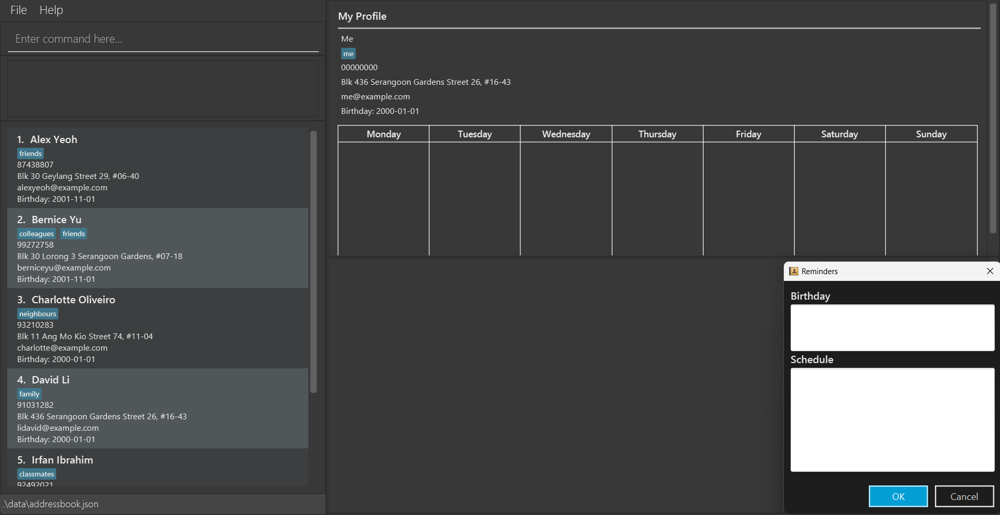
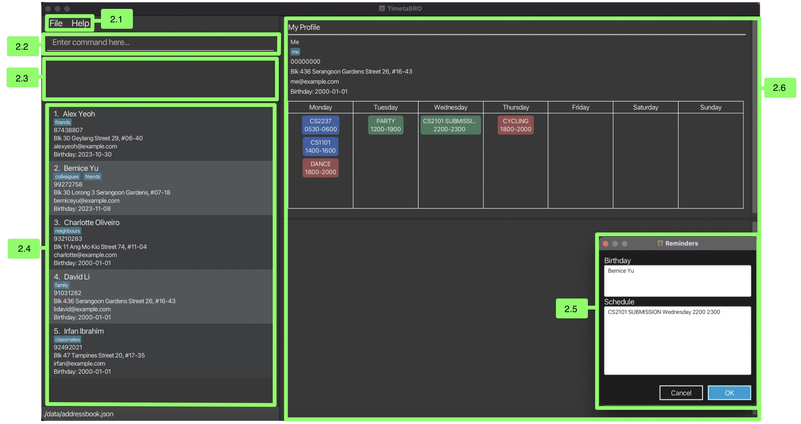
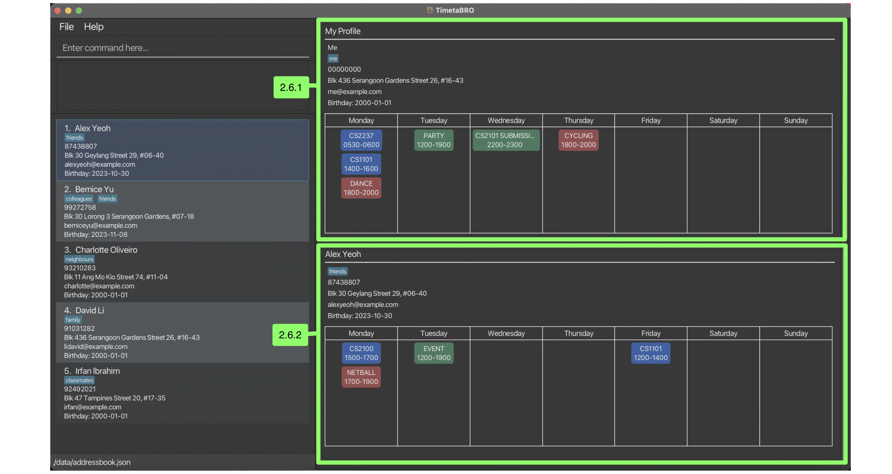

## **Introduction - What is TimetaBRO?**

Welcome to TimetaBRO, your ultimate companion for managing your university life, social interactions, and schedules. It is dedicated to NUS students who have many things on their plate and have trouble arranging meetings with friends and teammates.

In the past, NUS students had to tediously save their friend’s timetables, and compare them to their own. Most of the time, students do not even have the time to compare timetables and have to go through the hassle of coordination through messaging apps.

However, with TimetaBRO, you can now save your friends’ timetables, and ask it when your friends are free! Make scheduling meetups and meetings slick and easy, and while you’re busy scheduling the best dates, you can also save important details about your friends! No more forgetting birthdays or favourite foods, be the best friend you can be!

## **About the user guide**
This comprehensive user guide will walk you through all the exciting features TimetaBRO has to offer. New to TimetaBRO? Fret not! This guide will walk you through a quickstart to start using TimetaBRO.

This user guide will also provide information about its amazing functionalities in the features section, optimising your use of TimetaBRO even further. Included is a command summary for your perusal.

Additionally, we included FAQs and a glossary in case you have any additional questions after reading this user guide.

--------------------------------------------------------------------------------------------------------------------
* Table of Contents
{:toc}

--------------------------------------------------------------------------------------------------------------------

## **1. Quickstart**
Before we jump into it, let's make sure that your TimetaBRO is working properly!
1. Ensure you have Java 11 installed on your computer.
    * To check if Java 11 is currently installed, you may follow this short guide.
    * If Java 11 is not installed, you may follow the installation instructions over here.
2. Next, download the latest 'timetabro.jar' from [here](https://github.com/AY2324S1-CS2103T-W12-4/tp).
3. Copy the file to the folder you want to use as a home folder for TimetaBRO.
4. Double-click the file to start the app. The GUI similar to the below should appear in a few seconds. You should see a pop up. That is your reminder for the events and birthdays for the day!


<br><center><ins>Image: User interface layout of TimetaBRO upon startup with sample data</ins></center><br>

Here are some commands you can try:

  * add n/Owen p/91792309 b/ 2001-12-26:
  adds a friend named Owen, with phone number 91792309 and birthday on 26 December 2001
  * addschedule 1 type/module en/CS2101 h/Monday 1200 1400:
  adds a module CS2101 into the schedule of the first person in your friends list that occurs on Monday 12pm to 2pm
  * cft Friday 1200 1400:
  Filters your friend list to people who are free on these timings

Nice! Now you know the basic commands and have launched TimetaBRO, lets get into the finer details.

## **2. TimetaBRO User Interface**


<br><center><ins>Image: User interface layout breakdown of TimetaBRO</ins></center><br>

### 2.1. Toolbar

Provides functionality related to accessing the help pop-up or exiting TimetaBRO.

### 2.2. Command input box

This is where you can input commands to perform actions on TimetaBRO.

### 2.3. Command feedback box

This displays information related to your entered input in the command input box.

### 2.4. Friends list

This section displays all your friends in your list by default, 
and may be filtered display certain friends based on the executed command.

### 2.5. Daily reminder pop-up


<br><center><ins>Image: User interface layout breakdown of TimetaBRO</ins></center><br>

This reminder pop-up appears when you open the app.

#### 2.5.1. Birthday reminders

This section displays the names of friends whose birthday falls on the date of the day you open TimetaBRO.

#### 2.5.2. Event reminders

This section displays the non-recurring events you have for the day.

### 2.6. Profile display


<br><center><ins>Image: TimetaBRO profile display breakdown</ins></center><br>

#### 2.6.1. User display

At all times, this section displays the user profile. This consists of all the user information and the user schedule.

#### 2.6.2. Friend Display

This section is blank by default. 
It displays the profile of whichever friend is selected from the list by clicking on it. 
Upon selection, the list cell of that friend will turn blue.

#### 2.6.3. Display features

##### 2.6.3.1 Timetable layout

The timetable will be displayed under all the profile information, and each profile section is scrollable.

The days of the week are arranged from Monday to Sunday, and the timeslots are arranged from earliest to latest.

##### 2.6.3.1 Color coding

The event timeslots are color coded according to their type. 

Blue for module (recurring), red for cca (recurring), and green for dated (non-recurring) events.

##### 2.6.3.1 Event block formation

Each event block consists of the event name on the first line, and the start and end times on the second line.

## **3. Features**

<div markdown="block" class="alert alert-info">

**Notes about the command format:**<br>

* Words in `UPPER_CASE` are the parameters to be supplied by the user.<br>
  e.g. in `add n/NAME`, `NAME` is a parameter which can be used as `add n/John Doe`.

* Items in square brackets are optional.<br>
  e.g `n/NAME [t/TAG]` can be used as `n/John Doe t/friend` or as `n/John Doe`.

* Items with `…`​ after them can be used multiple times including zero times.<br>
  e.g. `[t/TAG]…​` can be used as ` ` (i.e. 0 times), `t/friend`, `t/friend t/family` etc.

* Parameters can be in any order.<br>
  e.g. if the command specifies `n/NAME p/PHONE_NUMBER`, `p/PHONE_NUMBER n/NAME` is also acceptable.

* Extraneous parameters for commands that do not take in parameters (such as `help`, `list`, `exit` and `clear`) will be ignored.<br>
  e.g. if the command specifies `help 123`, it will be interpreted as `help`.

* If you are using a PDF version of this document, be careful when copying and pasting commands that span multiple lines as space characters surrounding line-breaks may be omitted when copied over to the application.

* Clicking on your friend's name will display their timetable on the bottom half of the right hand side of TimetaBRO.
* Only times in 30-minute intervals are allowed. <br>
eg. `1430` and `1500` will be excepted, `1445` and `2359` will not be allowed.
</div>

### 3.1 User Commands

#### 3.1.1 Editing User Information: `user`

Personalise your profile information.

Format: `user n/NAME p/PHONE_NUMBER e/EMAIL a/ADDRESS b/BIRTHDAY [t/TAG]...​`

<div markdown="span" class="alert alert-primary">Tip:
A person can have any number of tags (including 0)
</div><br />

**Successful Command:**

- `Edited Your Details: NAME, Phone: PHONE_NUMBER, Email: EMAIL; Address: ADDRESS; Free Times: [FREE_TIMES]`

#### 3.1.2 Adding recurring event to user: `addschedule user`

This command adds a recurring event to your schedule.

Format: `addschedule user type/TYPE en/EVENT NAME h/DAY_TIME`

- Adds an event titled `EVENT_NAME`
- `TYPE` is a prefix that can either be `module` or `CCA`
- Event date and time will be equal to `DAY_TIME`<br>
where `DAY_TIME` must be entered in the format `Day HHMM HHMM`<br>
`Day` is any day of the week fully spelt out and is case-insensitive, `HHMM` is a 24H time format to indicate the start time and end time.
- Event names will be changed to all upper case regardless of whether it was keyed it in lower case or upper case.

**Successful Command:**\
Input:
````
addschedule user type/CCA en/Basketball h/Tuesday 1500 1600
````
Output:
````
New event added:
CCA:
BASKETBALL Tuesday 1500 1600 to [Your Name]
````

**Unsuccessful Command:**\
If a user uses the wrong format (i.e missing prefix, wrong event type),
this error message will be shown:
````
[error message]
Message Usage:
addschedule: Adds a schedule to the specified contact.
Parameters: INDEX type/EVENT_TYPE en/EVENT_NAMEh/[DAY_OF_WEEK START_TIME [HHMM] END_TIME [HHMM]]
Example: addschedule 1 type/cca en/Basketball
 h/Monday 1400 1600
NOTE: If you want to add a cca/module to yourself, use index user
Example: addschedule user type/cca en/Basketball h/Monday 1400 1600
````
The error message at the top of the command feedback above will specify what needs to be rectified.\
eg.\
Input:
````
addschedule user
````
Output:
````
Missing prefix(es) for en/ type/ h/ !
````

<div markdown="block" class="alert alert-info">

:information_source: Notes about the addschedule command:

* Timeslots added of type `module` will be colored blue, while those of type `CCA` will be colored red.
* To add an event that lasts until the end of the day (midnight), set the end timing as `2400`.
* You will not be allowed to add an event that clashes with any existing events.

</div>

#### 3.1.3 Adding non-recurring event to user: `addevent user`

This command adds a non-recurring event to your schedule.

Format: `addevent user en/EVENT NAME h/DAY_TIME`

- Adds an event titled `EVENT_NAME`
- Event date and time will be equal to `DATE` <br>
where `DATE` must be entered in the format `YYYY-MM-DD HHMM [start time] HHMM [end time]`
- Users can set whether they want to enable reminders for this event by inputting `y/n` under `[REMINDER]`
- Event names will be changed to all upper case regardless of whether it was keyed it in lower case or upper case

**Successful Command:**\
Input:
````
addschedule user type/CCA en/Basketball h/Tuesday 1500 1600
````
Output:
````
New event added:
CCA:
BASKETBALL Tuesday 1500 1600 to [Your Name]
````

**Unsuccessful Command:**\
If a user uses the wrong format (i.e missing prefix, wrong event type),
this error message will be shown:
````
Input should be in the format 'name [Day] HHMM HHMM yes/no', where:
'name' represents the name and should not contain spaces.
'Day' represents a day of the week (e.g. Monday).
'HHMM' represents a valid 24-hour time format in half-hour blocks (e.g. 0000, 1230, 2300).
The first 'HHMM' represents the starting time (e.g. '0830' for 08:30 AM).
The second 'HHMM' represents the ending time (e.g. '1730' for 05:30 PM).
y/n represents whether you want a reminder for this event.
````

<div markdown="block" class="alert alert-info">

:information_source: Notes about the `addevent` command:

* Timeslots added with this command will be green.
* To add an event that lasts until the end of the day (midnight), set the end timing as `2400`.
* You will not be allowed to add an event that clashes with any existing events.

</div>

#### 3.1.4 Deleting recurring event from user: `rmschedule user`

Removes the specified recurring item from the specified Person's schedule

**Format:** `rmschedule USER type/EVENT_TYPE en/EVENT_NAME`

type/EVENT_TYPE (Event type, either 'module' or 'CCA')\
en/EVENT_NAME (Event name)

**Successful commands:**\
Input:
````
rmschedule user type/CCA en/CS2103T Lecture
````
Output:
````
CS2103T LECTURE has been removed from [Your Name]!
````

**Unsuccessful commands:**\
If wrong command format is used (i.e missing prefixes, wrong event name):
````
Command format is invalid!
Parameters: INDEX
type/EVENT_TYPE
en/EVENT_NAME
Example: rmschedule 1 type/cca en/CS2103T Lecture
NOTE: If you want to remove an event from yourself, use index user
````

#### 3.1.5 Deleting non-recurring event from user: `rmevent user`

Removes the specified event from your schedule

**Format:** `rmevent user en/EVENT_NAME`

en/EVENT_NAME (Event name)

**Successful commands:**\
Input: 
````
rmevent user en/CS2103T LECTURE
````
Output:
````
Dated event 'CS2103T LECTURE' deleted from your calendar!
````

**Unsuccessful commands:**\
If wrong command format is used (i.e missing prefixes, wrong event name):
````
Command format is invalid!
Parameters: INDEX
en/EVENT_NAME
Example: rmevent user en/CS2103T Lecture
````

### 3.2 Friend Commands

#### 3.2.1 Adding a friend: `add`

Adds a person to TimetaBRO.

Format: `add n/NAME p/PHONE_NUMBER e/EMAIL a/ADDRESS b/BIRTHDAY [t/TAG]...​`

<div markdown="span" class="alert alert-primary">Tip:
A person can have any number of tags (including 0)
</div><br />

Successful Command:

- `Added {NAME} to the list.`

Unsuccessful Command:

- `Wrong inputs for prefix: {prefix with error}`

Examples:
* `add n/John Doe p/98765432 e/johnd@example.com b/2001-12-12 a/Downtown t/police`
* `add n/Betsy Crowe e/betsycrowe@example.com p/1234567 b/2002-04-19 a/Upurs Street t/criminal`

#### 3.2.2 Editing friend information: `edit`

Edits an existing friend in TimetaBRO.

Format: `edit INDEX [n/NAME] [p/PHONE_NUMBER] [e/EMAIL] [a/ADDRESS] [b/BIRTHDAY] [t/TAG]…​`

* Edits the person at the specified `INDEX`. The index refers to the index number shown in the displayed friend list. The index **must be a positive integer** 1, 2, 3, …​
* At least one of the optional fields must be provided.
* Existing values will be updated to the input values.
* When editing tags, the existing tags of the person will be removed i.e adding of tags is not cumulative.
* You can remove all the person’s tags by typing `t/` without
  specifying any tags after it.

**Successful Command:**

Changes the specified parameters of specified friend’s profile

**Unsuccessful Command:**

Displays an error message:
````
Please specify the details to change! Correct syntax: edit INDEX [n/NAME] [a/ADDRESS] [p/PHONE_NUMBER] [e/EMAIL] [t/TAG]
````

Examples:
*  `edit 1 p/91234567 e/johndoe@example.com` Edits the phone number and email address of the 1st person to be `91234567` and `johndoe@example.com` respectively.
*  `edit 2 n/Betsy Crower m/` Edits the name of the 2nd person to be `Betsy Crower` and clears all existing modules.

#### 3.2.3 Deleting a friend's information: `delete`

Deletes the specified friend from TimetaBRO.

Format: `delete INDEX`

* Deletes the person at the specified `INDEX`.
* The index refers to the index number shown in the displayed person list.
* The index **must be a positive integer** 1, 2, 3, …​

**Successful Command:**

Delete person from user’s profile.

Output:
````
[Friend's Name] deleted.
````
The friend should be removed from the friend's list.

**Unsuccessful Command:**

- `Cannot delete (NAME)`
- `Cannot find (INDEX)`

Examples:
* `list` followed by `delete 2` deletes the 2nd person in the list.
* `find Betsy` followed by `delete 1` deletes the 1st person in the results of the `find` command.

#### 3.2.4 Listing all friends: `list`

Shows a list of all added friends.

Format: `list`

#### 3.2.5 Viewing friend's profile

Show your friend's timetable.

**How to use:**
1. Scroll down your list of friends, until you locate the friend's timetable you want to see.
2. Click on the friend's profile. You should see their details appear, on the bottom right panel.

#### 3.2.6 Adding recurring event to friend: `addschedule`

This command adds a recurring event to a friend's schedule.

Format: `addschedule INDEX type/TYPE en/EVENT NAME h/DAY_TIME`

- Adds an event titled `EVENT_NAME` to the specified friend at `INDEX`
- `TYPE` is a prefix that can either be `module` or `CCA`
- Event date and time will be equal to `DAY_TIME`
  where `DAY_TIME` must be entered in the format `[monday/tuesday/wednesday/thursday/friday/saturday/sunday] HHMM [start time] HHMM [end time]`
- Event names will be changed to all upper case regardless of whether it was keyed it in lower case or upper case.

**Successful Command:**\
Input:
````
addschedule 1 type/module en/CS2030 h/Monday 1000 1400
````

Output:
````
New event added:
Module:
CS2030 Monday 1000 1400 to [Friend Name]
````

**Unsuccessful Command:**\
If a user uses the wrong format (i.e missing prefix, wrong event type),
this error message will be shown:
````
[error message]
Message Usage:
addschedule: Adds a schedule to the specified contact.
Parameters: INDEX type/EVENT_TYPE en/EVENT_NAMEh/[DAY_OF_WEEK START_TIME [HHMM] END_TIME [HHMM]]
Example: addschedule 1 type/cca en/Basketball
 h/Monday 1400 1600
NOTE: If you want to add a cca/module to yourself, use index user
Example: addschedule user type/cca en/Basketball h/Monday 1400 1600
````
The error message at the top of the command feedback above will specify what needs to be rectified.\
eg.\
Input:
````
addschedule
````
Output:
````
Missing prefix(es) for en/ type/ h/ !
````
Input: 
````
addschedule type/cca en/event h/Monday 1200 1800
````
Output: 
````
Please put an index!
````

<div markdown="block" class="alert alert-info">

:information_source: Notes about the addschedule command:

* Timeslots added of type `module` will be colored blue, while those of type `CCA` will be colored red.
* To add an event that lasts until the end of the day (midnight), set the end timing as `2400`.
* You will not be allowed to add an event that clashes with any existing events.

</div>

#### 3.2.7 Adding non-recurring event to friend: `addevent`

This command adds a dated, non-recurring event to you or your friend's schedule.

Format: `addevent INDEX en/EVENT NAME h/DATE r/REMINDER`

- Adds an event titled `EVENT_NAME` to the specified friend at `INDEX`
- Event date and time will be equal to `DATE`
  where `DATE` must be entered in the format `YYYY-MM-DD HHMM [start time] HHMM [end time]`
- Users can set whether they want to enable reminders for this event by inputting `y/n` under `[REMINDER]`
- Event names will be changed to all upper case regardless of whether it was keyed it in lower case or upper case

**Successful Command:**

Input:
````
addevent 1 en/CS2030 Finals h/2023-10-31 1000 1400 r/y
````
Output:
````
New event added:
Dated Event:
CS2030 Finals 2023-10-31 1000 1400 to [Friend Name]
````

**Unsuccessful Command:**

If a user puts an invalid index,
this error message will be shown

````
Invalid index!
addevent: Adds a non-recurring event to the calendar.
Parameters: INDEX en/EVENT_NAME h/[Date [YYYY-MM-DD] StarTime (HHMM) EndTime (HHMM)] r/[REMINDER: y/n]`\
Example: addevent 1 en/CS2103T Lecture h/2020-03-02 1400 1600 r/y`\ 

Note: If you are adding a meetup event, then index refers to the index of the friend you are meeting with.
If you are adding a dated event, then index should be the index of the friend you are adding the dated event to or 'user' if you would like to add the event to yourself
````

If a user uses the wrong format (i.e missing prefix, wrong event type),
this error message will be shown
````
Input should be in the format 'name YYYY-MM-DD HHMM HHMM yes/no', where:
'name' represents the name and should not contain spaces.
'YYYY-MM-DD' represents a date (e.g., '2023-10-24').
'HHMM' represents a valid 24-hour time format in half-hour blocks (e.g., 0000, 1230, 2300).
The first 'HHMM' represents the starting time (e.g., '0830' for 08:30 AM).
The second 'HHMM' represents the ending time (e.g., '1730' for 05:30 PM).
y/n represents whether you want a reminder for this event.
````

<div markdown="block" class="alert alert-info">

:information_source: Notes about the `addevent` command:

* Timeslots added with this command will be green.
* To add an event that lasts until the end of the day (midnight), set the end timing as `2400`.
* You will not be allowed to add an event that clashes with any existing events.

</div>

#### 3.2.8 Deleting recurring event from friend: `rmschedule`

Removes the specified recurring item from the specified Person's schedule<br>
If there are multiple schedules with the same names, this command will remove the earliest day in the week, but the later time in the same day.<br>

**Format:**\
To remove a scheduled event, you can use the rmschedule command with the following parameters:

`rmschedule INDEX type/EVENT_TYPE en/EVENT_NAME`

INDEX (Index of the friend)\
type/EVENT_TYPE (Event type, either 'module' or 'CCA')\
en/EVENT_NAME (Event name)

**Successful commands:**\
Input:
````
rmschedule 1 type/CCA en/CS2103T Lecture
````
Output:
````
CS2103T LECTURE has been removed from [Friend's Name]!
````

**Unsuccessful commands:**\
If an invalid index is used:
````
Invalid index!
Parameters: INDEX
type/EVENT_TYPE
en/EVENT_NAME
Example: rmschedule 1 type/module en/CS2103T Lecture
NOTE: If you want to remove an event from yourself, use index user
Example: rmschedule user type/module en/CS2103T Lecture
````

If wrong command format is used (i.e missing prefixes, wrong event name):
````
Command format is invalid!
Parameters: INDEX
type/EVENT_TYPE
en/EVENT_NAME
Example: rmschedule 1 type/cca en/CS2103T Lecture
NOTE: If you want to remove an event from yourself, use index user
````

#### 3.2.9 Deleting non-recurrring event from friend: `rmevent`

Removes the specified event from the specified Person<br>
If there are multiple schedules with the same names, this command will remove the earliest day in the week, but the later time in the same day.<br>

**Format:**\
To remove an event, you can use the rmevent command with the following parameters:

`rmevent INDEX en/EVENT_NAME`

INDEX (Index of the friend on the address book list or 'user')\
en/EVENT_NAME (Event name)

**Successful commands:**\
Input:
````
rmevent 1 en/CS2103T Lecture
````
Output:
````
Dated event 'CS2103T LECTURE' deleted from [Friend's Name]'s calendar!
````

**Unsuccessful commands:**\
If an invalid index is used:
````
Invalid index!
Parameters: INDEX
en/EVENT_NAME
Example: rmevent 1 en/CS2103T Lecture
NOTE: If you want to remove an event from yourself, use index user
Example: rmevent user en/CS2103T Lecture
````

If wrong command format is used (i.e missing prefixes, wrong event name):
````
Command format is invalid!
Parameters: INDEX
en/EVENT_NAME
Example: rmevent 1 en/CS2103T Lecture
NOTE: If you want to remove an event from yourself, use index user
Example: rmevent user en/CS2103T Lecture
````

#### 3.2.10 Finding common free times with your friend: `cft`

Finds friend(s) with the same free times as you.

Format: <br>
**Finding common free times with a specific friend**<br>
`cft INDEX`

* Finds common free times with friend of the specified `INDEX`.

**Finding common free times with entire friends list**<br>
`cft`

* Finds common free times with **all friends** in the list if `INDEX` is not included.

**Successful Command:**\
Input:
````
cft
````
Output:\
Displays all the common free times you have with all your friends in your friend list.
````
Here are the contacts with the same free time as you:
You and Bernice Yu have no common free time!
You and Charlotte have no common free time!
You have common free times with Alex Yeoh at:
[Monday 0000 0800]
[Monday 2000 2400]
[Tuesday 0000 1300]
[Wednesday 0000 1200]
[Wednesday 1800 2400]
[Thursday 0000 2400]
[Friday 0000 2400]
[Saturday 0000 2400]
[Sunday 0000 2400]
````
Input: 
````
cft 1
````
Output: 
````
You have common free times with Alex Yeoh at:
[Monday 0000 0800]
[Monday 2000 2400]
[Tuesday 0000 1300]
[Wednesday 0000 1200]
[Wednesday 1800 2400]
[Thursday 0000 2400]
[Friday 0000 2400]
[Saturday 0000 2400]
[Sunday 0000 2400]
````

If you have no common free times with a contact, it will display:
````
You and [Friend's Name] have no common free time!
````

If your entire timetable is full for the whole week, it will return: 
````
You have no free time!
````

If you execute `cft` and you have no common free times with any contact, it will return:
````
You have no contacts with the same free time as you!
````

**Unsuccessful Command:**

If user inputs a friend that does not exist, the app will display\
`There is no such contact in your contacts!`

Examples:
* `cft` lists all friends .
* `cft n/Betsy` finds people with the name `Betsy` and displays the common free times with this list.

### 3.3 Reminder Commands

#### 3.3.1 Set reminder for non-recurring events: `setReminder`

Sets a reminder for a dated event from the user's schedule

Format: \
To set a reminder a dated event in your schedule, you can use the setReminder command with the following parameters:

`setReminder EVENT_NAME`

**Successful command:**\
Input:
````
setReminder CS2103T Lecture
````
Output:
````
Reminder set for following event:
CS2103T Lecture
````

**Unsuccessful command:**

If an invalid event name is used, it will return:
````
No such event exists!
````

#### 3.3.2 Remove reminder for non-recurring events: `rmReminder`

Remove a reminder for a dated event from the user's schedule

Format: `rmReminder EVENT_NAME`

**Successful command:**\
Input:
````
rmReminder CS2103T Lecture
````
Output:
````
Reminder removed for following event:
CS2103T Lecture
````

**Unsuccessful command:**\
If an invalid event name is used, it will return:
````
No such event exists!
````

### 3.4 Other Commands

#### 3.4.1 Viewing help: `help`

Shows a message explaining how to access the help page.

Format: `help`

#### 3.4.2 Clearing all entries: `clear`

Clears all entries from TimetaBRO.

Format: `clear`

**Successful Command:**

Output:
````
All friends have been deleted.
````
The entire friend list should be emptied.

#### 3.4.3 Exiting the program: `exit`

Exits the program.

Format: `exit`

The app closes after saving all data.

--------------------------------------------------------------------------------------------------------------------

### Saving the data

TimetaBRO data are saved in the hard disk automatically after any command that changes the data. There is no need to save manually.

### Editing the data file

TimetaBRO data are saved automatically as a JSON file `[JAR file location]/data/timetabro.json`. Advanced users are welcome to update data directly by editing that data file.

<div markdown="span" class="alert alert-warning">Caution:
If your changes to the data file makes its format invalid, TimetaBRO will discard all data and start with an empty data file at the next run. Hence, it is recommended to take a backup of the file before editing it.
</div>

--------------------------------------------------------------------------------------------------------------------

## **FAQ**

**Q**: How do I transfer my data to another Computer?<br>
**A**: Install the app in the other computer and overwrite the empty data file it creates with the file that contains the data of your previous TimetaBRO home folder.

**Q**: Is TimetaBRO compatible with Mac and Linux operating systems, or is it Windows-specific?<br>
**A**: TimetaBRO is compatible with multiple operating systems, including Windows, Mac, and Linux. It runs on systems that support Java 11, so you can use it on your preferred platform.

**Q:** Can I import my friend's schedule from a different calendar application into TimetaBRO?<br>
**A:** Currently, TimetaBRO does not offer a direct import feature for schedules from other calendar applications. You'll need to manually add your friends' schedules to TimetaBRO using the add command.

**Q:** Is there a way to set recurring events for specific dates or weekdays, like every Tuesday, without manually adding them one by one?<br>
**A:** Yes, you can add recurring events for specific weekdays in TimetaBRO using the addschedule command. This feature allows you to set events for particular days of the week, making it easier to input recurring events.

**Q:** What happens if I accidentally delete a friend or event in TimetaBRO? Is there a way to recover deleted data?<br>
**A:** Unfortunately, TimetaBRO does not have a built-in data recovery feature. When you delete a friend or event, the data is permanently removed from the application. It's essential to double-check your actions to avoid accidental deletions.

**Q:** How can I customize the reminder settings for events added to TimetaBRO?<br>
**A:** You can customize the reminder settings for events when adding them using the addevent command. The r/y or r/n option allows you to enable or disable reminders for specific events.

**Q:** Is there a way to share my TimetaBRO schedule with others or export it to a different format, such as a calendar file?<br>
**A:** TimetaBRO currently does not support sharing schedules with others or exporting them to external formats. It primarily functions as a personal scheduling tool.

**Q:** Can I remove a specific event or schedule from my timetable or my friends' timetable? <br>
**A:** Currently, there is no way to select a specific event or schedule to remove. However,you may set slightly different names for events with the same name, such as 'Meetup with Jason (1)' and 'Meetup with Jason (2)' so that you can select a the specific event to delete later.

**Q:** If I have two events that overlap, can I add both of them to the calendar? <br>
**A:** As TimetaBRO was designed to be a timetable management app, we would not be allowing overlapping events to be added into the timetable.

--------------------------------------------------------------------------------------------------------------------

## **Known issues**

1. **When using multiple screens**, if you move the application to a secondary screen, and later switch to using only the primary screen, the GUI will open off-screen. The remedy is to delete the `preferences.json` file created by the application before running the application again.

--------------------------------------------------------------------------------------------------------------------

## **Command Summary**

| Action                                      | Format and Examples                                                                                                                                                                |
|---------------------------------------------|------------------------------------------------------------------------------------------------------------------------------------------------------------------------------------|
| **Add a Friend**                            | `add n/NAME p/PHONE_NUMBER e/EMAIL a/ADDRESS b/BIRTHDAY [t/TAG]…​`<br> Example: `add n/John Doe p/98765432 e/johnd@example.com a/1 Hon Sui Sen Dr, Singapore 117588 b/2023-11-05 t/police` |
| **Add an Event to friend**                  | `addevent INDEX en/EVENT NAME h/DATE r/REMINDER`<br> Example: `addevent 1 en/CS2030 Finals h/2023-10-31 1000 1400 r/y`                                                             |
| **Add an Event to user**                    | `addevent user en/EVENT NAME h/DATE r/REMINDER`<br> Example: `addevent user en/CS2030 Finals h/2023-10-31 1000 1400 r/y`                                                           |
| **Remove an Event from friend**             | `rmevent INDEX en/EVENT NAME`<br> Example: `rmevent 1 en/CS2103T Lecture`                                                                                                          |
| **Remove an Event from user**               | `rmevent user en/EVENT NAME`<br> Example: `rmevent user en/CS2103T Lecture`                                                                                                        |
| **Add a Recurring Event to friend**         | `addschedule INDEX type/EVENT_TYPE en/EVENT_NAME h/DAY_TIME`<br> Example: `addschedule 1 type/module en/CS2030 h/Monday 1000 1400`                                                 |
| **Add a Recurring Event to user**           | `addschedule user type/EVENT_TYPE en/EVENT_NAME h/DAY_TIME`<br> Example: `addschedule 1 type/module en/CS2030 h/Monday 1000 1400`                                                  |
| **Remove a Recurring Event from friend**    | `rmschedule INDEX type/EVENT_TYPE en/EVENT_NAME`<br> Example: `rmschedule 1 type/CCA en/CS2103T Lecture`                                                                           |
| **Remove a Recurring Event from user**      | `rmschedule user type/EVENT_TYPE en/EVENT_NAME`<br> Example: `rmschedule 1 type/CCA en/CS2103T Lecture`                                                                            |
| **Remove a Reminder**                       | `rmReminder EVENT_NAME`<br> Example: `rmReminder CS2103T Lecture`                                                                                                                  |
| **Set a Reminder**                          | `setReminder EVENT_NAME`<br> Example: `setReminder CS2103T Lecture`                                                                                                                |
| **Clear All Entries**                       | `clear`                                                                                                                                                                            |
| **Delete a Friend**                         | `delete INDEX`<br> Example: `delete 3`                                                                                                                                             |
| **Edit Friend Info**                        | `edit INDEX [n/NAME] [p/PHONE_NUMBER] [e/EMAIL] [a/ADDRESS] [b/BIRTHDAY] [t/TAG]…​`<br> Example: `edit 2 n/James Lee e/jameslee@example.com`                                       |
| **Edit User Info**                          | `user [n/NAME] [p/PHONE_NUMBER] [e/EMAIL] [a/ADDRESS] [b/BIRTHDAY] [t/TAG]…​`<br> Example: `user n/James Lee e/jameslee@example.com`                                               |
| **List All Friends**                        | `list`                                                                                                                                                                             |
| **View Help**                               | `help`                                                                                                                                                                             |
| **Find Common Free Times with friend**      | `cft [INDEX]` Example: `cft 1`                                                                                                                                                     |                                                                       
| **Find Common Free Times with all friends** | `cft`<br>                                                                                                                                                                          |                                                                       

