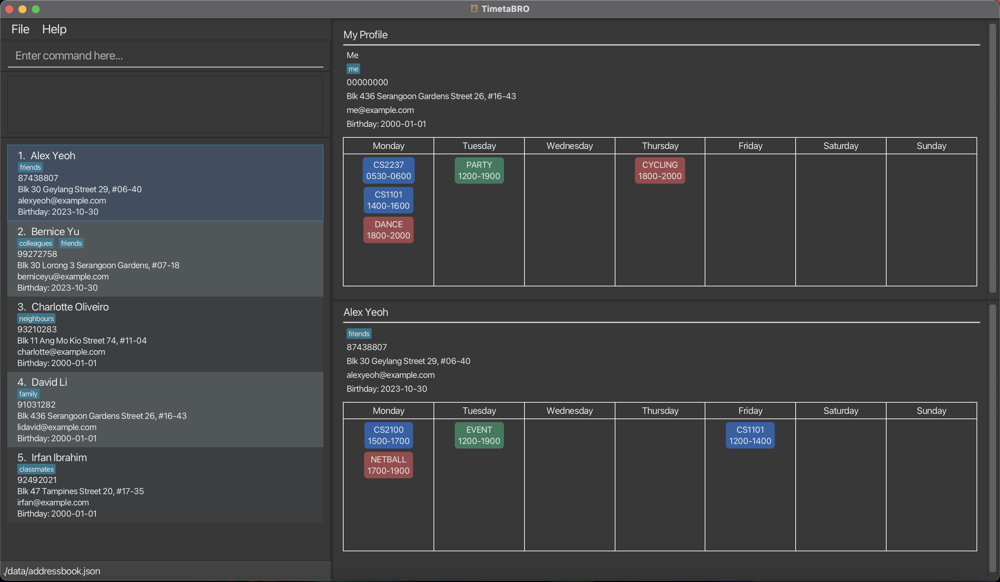

**TimetaBRO is a desktop application for arranging meetups with busy friends.**
Created by NUS students, TimetaBRO is dedicated to fellow NUS students to aid in
seamless schedule comparison and coordination.

Before TimetaBRO, the typical method of comparing timetables with your peers 
either for casual meetups or group projects consisted of hopping between screenshots of timetables. 
However, with TimetaBRO, you now can store the schedules of your peers on one platform with easy visual comparison, 
as well as our `cft` command that helps you find common free times
with the people in your friend list almost instantaneously!
No more wasting time going back and forth with your friends trying to find meetup times, 
and no more jumping around the media of your chats to view your friends timetables!

Manage your friendships, meetings, and commitments better and faster with TimetaBRO!

* If you are interested in using TimetaBRO, head over to the [_Quick Start_ section of the **User Guide**](UserGuide.html#quick-start).
* If you are interested about developing TimetaBRO, the [**Developer Guide**](DeveloperGuide.html) is a good place to start.

**Acknowledgements**

* Libraries used: [JavaFX](https://openjfx.io/), [Jackson](https://github.com/FasterXML/jackson), [JUnit5](https://github.com/junit-team/junit5)
